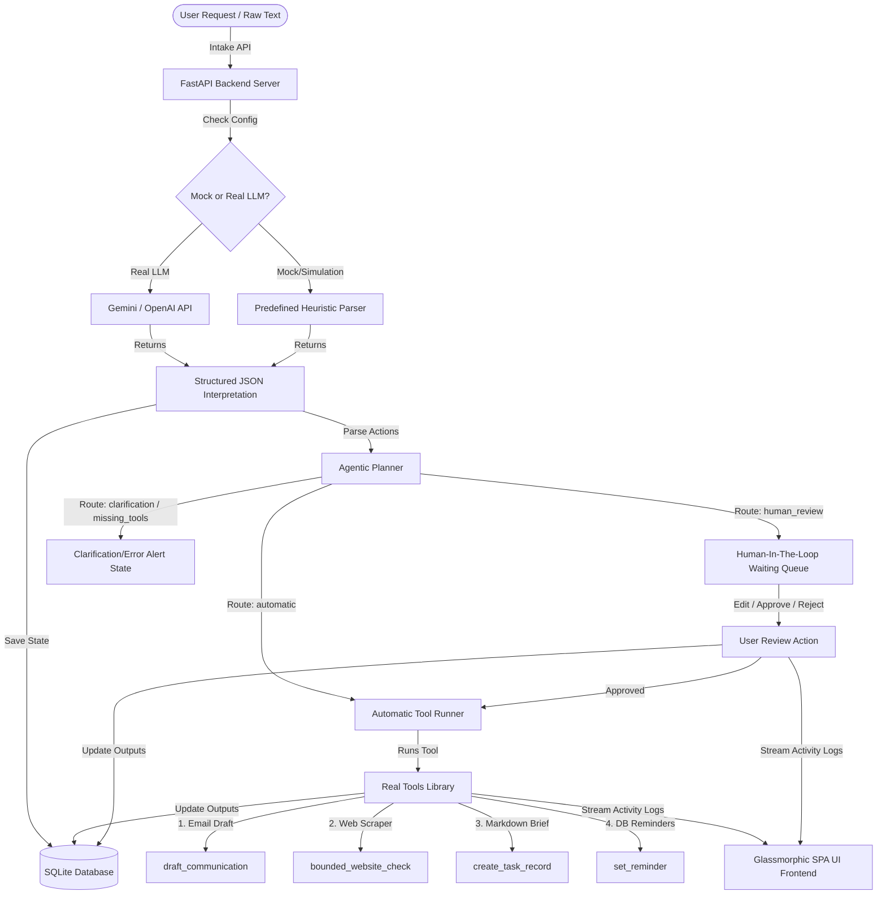

# Agentic Work Intake & Execution Prototype

A lightweight, robust agentic application that turns unstructured incoming work — such as emails, meeting notes, instructions, or bug reports — into a structured, reviewable, and automated workflow. 

It features a responsive, glassmorphic dark-theme Single-Page Application (SPA) dashboard, a FastAPI backend, an SQLite database for persistence, four integrated automation tools, and real-time human-in-the-loop validation mechanisms.

---

## Architecture Diagram



---

## Agent Workflow

```
Intake ➔ Interpretation ➔ Planning ➔ Tools ➔ Approval ➔ Persistence ➔ Completion
```

1. **Intake**: Raw, unstructured text is submitted via the Web UI text area or the FastAPI `/api/intake` endpoint.
2. **Interpretation**: The AI parses the unstructured input to extract key metadata matching a strict Pydantic schema: `task_title`, `summary`, `priority`, `deadline`, list of `missing_information`, and a series of planned `action_items`.
3. **Planning**: Each extracted action item is routed into one of four pathways:
   - **`automatic`**: Runs instantly if matching tools exist.
   - **`human_review`**: Held in a queue for user approval.
   - **`clarification`**: Flagged as blocked if critical information is missing.
   - **`missing_tools`**: Marked as cannot execute with current system capabilities.
4. **Tools**: Automatically triggers execution of matching Python functions:
   - `draft_communication`: Generates custom email/slack copy.
   - `bounded_website_check`: Real web scrape using HTTP client and BeautifulSoup.
   - `create_task_record`: Creates a structured markdown brief saved locally.
   - `set_reminder`: Schedules simulated database alerts.
5. **Approval (Human-In-The-Loop)**: Interactive controls in the Web UI allow humans to **Approve**, **Reject**, or **Edit** action parameters (such as email text or delay days) before execution.
6. **Persistence**: State is written to SQLite across 5 relational tables, tracking requests, interpretations, actions, reminders, and activity logs.
7. **Completion**: Once all scheduled actions complete or fail, the overall intake status is updated, and the persistent output is logged in the UI.

---

## Setup & Running Instructions

### Prerequisites
- Python 3.10 or higher (Tested on Python 3.13.3)
- Internet connection (for website checking and real LLM calls)

### 1. Installation
Clone the repository and install the dependencies listed in `requirements.txt`:
```bash
# Navigate to project directory
cd agentic-work-intake

# Install required python packages
pip install -r requirements.txt
```

### 2. Environment Variables
No credentials are required to run in **Simulation/Demo Mode**. If you wish to use real LLMs (Gemini or OpenAI), create a `.env` file in the project root:
```env
# Optional API Keys for Real LLM support (Otherwise, enter them via the Settings panel in the Web UI)
GEMINI_API_KEY=your_gemini_api_key_here
OPENAI_API_KEY=your_openai_api_key_here
```

### 3. Initialize & Run Application
Start the FastAPI server:
```bash
python -m uvicorn app:app --reload --port 8000
```
Open your browser and navigate to: **[http://localhost:8000](http://localhost:8000)**.

### 4. Running Automated Tests
To run the automated verification script that tests database persistence, website auditing, and failure recovery:
```bash
python verify_prototype.py
```

---

## Design Decisions

- **Dual Ingest Engine (Mock vs Real)**: To ensure the application is instantly evaluable without forcing graders to supply API keys, we built a beautiful, dynamic simulation fallback. The UI has buttons to load all three scenarios.
- **Glassmorphic Single-Page Application (SPA)**: Custom dark mode styling using glassmorphism (`backdrop-filter`) and vibrant cyan/purple glow aesthetics, built entirely in vanilla HTML/CSS/JS for performance, responsiveness, and zero-compile overhead.
- **SQLite Database Persistence**: Retains state across sessions. Tables exist for raw intake records, AI interpretation schemas, action plans, logs, and simulated reminders.
- **Dynamic Action Editing**: Instead of just Approve/Reject, the UI dynamically renders customized forms matching the tools' JSON schemas, allowing humans to edit parameters on the fly.
- **Sensible Failure Path**: If the scraper tool is given a broken URL, it does not crash the system. Instead, it catches the network exception, logs a clear `ERROR` to the Activity Trace, and flags the specific Action Item as `Failed` in the DB.

---

## Limitations

1. **Simulated Reminders**: Reminders are saved to the database but do not trigger real calendar invites or background task workers to alert external users.
2. **In-Memory API Key Storage**: When API keys are pasted in the UI, they are kept in runtime state and not persisted to disk for safety.
3. **Draft Communication Email Sending**: The prototype drafts email communication copy but does not integrate with SMTP or SendGrid services to deliver mail.

---

## What We Would Build Next (Future Scope)

1. **Active Reminder Daemon**: Build a background task worker (using Celery or APScheduler) to dispatch real Slack/Email reminders when their delay time expires.
2. **Multi-Agent Orchestrator (LangGraph)**: Transition the sequential planner into a graph-based state machine for multi-step agent interactions and feedback loops.
3. **Local LLM Integration (Ollama)**: Enable running completely offline using models like Llama 3 or Mistral via local endpoints.
4. **Active Workspace Scraper**: Expand the website check tool into a deeper spider check that maps sub-pages and identifies styling gaps automatically.
5. **Authentications & User Access Roles**: Add OAuth login (Google/GitHub) and segment permissions between agents and human administrators.

---

## How I Used AI

### Tools Used
- Gemini 3.5 Flash via Google Antigravity Code Editor

### Use Cases
1. **FastAPI Route Skeleton**: Used to generate boilerplate FastAPI setups and SQLite database connection utilities.
2. **CSS Glassmorphism Palette**: Assisted in selecting modern color variables, neon glow drop-shadow filters, and designing smooth slide transitions.
3. **Web Scraper DOM checks**: Designed the BeautifulSoup tags parsing routine to extract SEO descriptions and responsive viewport configurations.

### AI Mistake & Solution
- **The Mistake**: The AI originally suggested using Unicode emoji checkmarks (`✔` and `✘`) inside the stdout print statements of `verify_prototype.py`.
- **How Identified**: During Windows CLI execution, the script threw a crash error: `UnicodeEncodeError: 'charmap' codec can't encode character '\u2714'`. This occurs because standard Windows terminals run with CP1252 character maps that do not support high-unicode emojis.
- **How Fixed**: Refactored the verification print statements to use standard ASCII square brackets and capital letter strings (e.g. `[PASS]` and `[FAIL]`), ensuring complete cross-platform shell compatibility.
